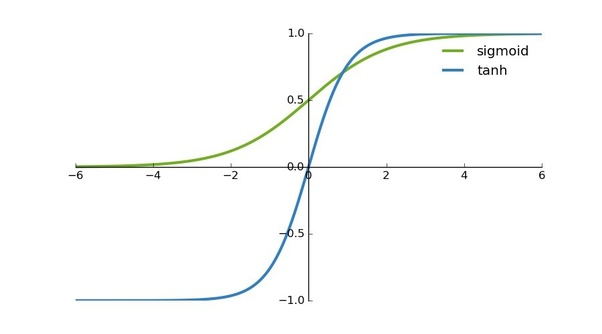

# Deep-Learning

## Activation Function
* This decides whether the neuron is firing or not. Ex: Sigmoid, tanh. Sigmoid and Tanh has Vanishing Gradient problem. It means the derivative of these functions at one point would be almost zero(when the S curve flattens) and when this zero is back propagated the learning becomes really slow.

